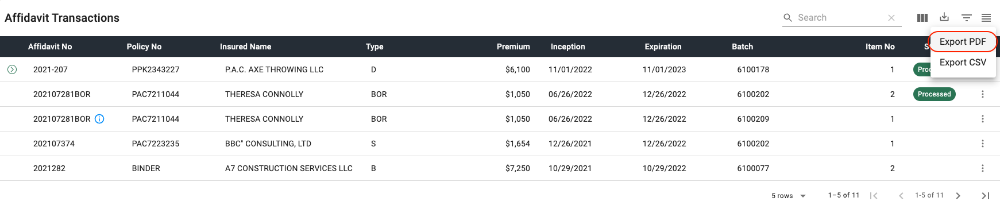

## Getting Started

### Overview

An application that provides new tools that will assist the ELANY Helpdesk to provide support to system users. These tools will utitlize various services to provide access into different components of the system and its data.

#### Background

Helpdesk users are currently required to use the two independent systems to review transaction and policy data, making it harder to identity the sequence and processing of the various entries.

#### Purpose

The Transaction Inquiry page will include an enhanced transaction search feature that will allow Helpdesk personnel to review transaction related information from the Affidavit and Back-Office databases. This will allow for an overview of transactional activity on items, including attachments and processing status.

---

<section markdown="1">

### Launching from EEFS

1. Log in to the ELANY Electronic Filing System.

2. Click on the **TRANS INQUIRY** button in the side navigation located under the **HELPDESK** section in the side navigation. _(Figure 1)_.

3. The Transaction Inquiry page will launch in the main window of the Affidavit Site. _(Figure 1)_.

_Figure 1 - Launching the Transaction Inquiry Page from EEFS_

</section>

---

## Transaction Search

<section markdown="1">

### Broker Security Profile Selection

This selection will allow the helpdesk user to search fro broker specific submitted and processed transactions. Initially, the presented form will require the user to select a broker for the dropdown list. Typing in the control will filter the dropdown list, allowing for quicker selection. All data searches will be limited to the selected brokerage. _(Figure 2)_.

_Figure 2 - Broker / Security Profile Selection Input_

### Procedure Summary

1. Click on the Broker / Security Profile selection input to view the available options in alphabetical order. _(Figure 3)_.

2. Type into the input to filter the Broker / Security Profile list. _(Figure 4)_.

3. Click on the desired profile from the list to make your selection and continue the search. _(Figure 5)_.

_Figure 3 - Broker / Security Profile Full List_

_Figure 4 - Broker / Security Profile Selection Input - Filtered List_

_Figure 5 - Broker / Security Profile Selected - Search Enabled_

## Quick Search

Once a broker has been selected the transaction search controls will become accessible. For quick searches, the user can utilize the quick search controls, including the Search By, From and To dates (covering inception on effective date). The quick search will allow the user to enter a value that could represent an Affidavit Number or Policy Number. _(Figure 6)_.

### Procedure Summary

1. Type in the Search by Affidavit No or Policy No input and then press **ENTER** or click the **SEARCH BUTTON**. _(Figure 6)_.

2. Further filter the search by entering an Inception Date and Expiration Date and then pressing **ENTER** or click the **SEARCH BUTTON**. _(Figure 7)_.

_Figure 6 - Quick Search - Search by Affidavit No or Policy No_

_Figure 7 - Quick Search - Inception Date Range_

## Advanced Search

The advanced search feature allows for the user to execute a more refined search. The user will click the button to the right of the search input, _(Figure 8)_, to view the advanced search inputs. The advanced search will allow the user to enter specific search conditions, including Affidavit No, Policy No, Insured Name, Batch No, Batch Contact, Reference, or a Premium Range.

_Note: Sometime the brokers will include special characters in the affidavit and policy number fields. These will be ignored for searching but will be included in the the displayed results._

_Figure 8 - Advanced Search Inputs_

### Procedure Summary - Clearing Advanced Search

1. To clear all the search inputs click the **CLEAR** button to the right of the Advanced Search label. _(Figure 9)_.

2. To clear a single input click the **X** button to the right of the input. _(Figure 10)_.

_Figure 9 - Advanced Search - Clear All Inputs_

_Figure 10 - Advanced Search - Clear Single Input_

---

## Affidavit Transactions

### Affidavit Table Features

#### Table Density

The user will be able to toggle the density of the table rows by clicking the **TOGGLE DENSITY** icon button located in the top right hand corner of the table, shown in Figure 11. By default the table rows are set to dense so toggling the density will make the table rows larger as shown in Figure 12. To reset the table density to default click the **TOGGLE DENSITY** icon button again.

_Figure 11 - Toggle Table Density Icon Button / Table Density Default_

_Figure 12 - Table Density Normal_

#### Filtering Results

The user will be able to filter the result set by clicking the **SHOW FILTERS** icon button located next to the **TOGGLE DENSITY** icon button, shown in Figure 13. Once the filters are visible the user can filter by column to narrow down the result set. The user will select a column to filter the set by, as shown in Figure 14. Then use the input associated with that column to filter the result set by selected column for the search term entered into the input, as shown in Figure 15. To return to the default data set and remove the filter inputs, click the **SHOW FILTERS** icon button again, although the tooltip will now say **Hide Filters**, as shown in Figure 16.

_Figure 13 - Show Filters Icon Button_

_Figure 14 - Filter by Selected Column_

_Figure 15 - Filtered Result Set_

_Figure 16 - Hide Filter Inputs_

#### Exporting Results

The user will be able to export the result set by clicking the **EXPORT** icon button located next to the **SHOW FILTERS** icon button, shown in Figure 17. Once the button is clicked the user will have the option to export the result set as a PDF or a CSV, as shown in Figures 18 & 19.

_Note: Any other table actions taken before exporting the result set such as filtering, searching, hiding table columns will affect the results that show up in the exported data._

_Figure 17 - Export Icon Button_

_Figure 18 - Export as PDF_

_Figure 19 - Export as CSV_

#### Showing / Hiding Columns

The user will be able to show and hide columns using the **SHOW COLUMNS** icon button located next to the **EXPORT** icon button, shown in Figure 20. Once the icon button is clicked the user can uncheck the columns they wish to hide from the table shown in Figures 21 & 22.

_Figure 20 - Show Columns Icon Button_

_Figure 21 - Column Name Checklist_

_Figure 22 - Hide Premium Column_

#### Searching Results

The user will be able to search the table results by using the **SEARCH** input located in the table toolbar, shown in Figure 23. The search will differ from the filter inputs by the ability to search every column in the table for the search term instead of a single column, as shown in Figure 24.

_Figure 23 - Table Search Input_

_Figure 24 - Search Table by Search Term_

#### Related Transactions

If there are any child transactions available for the transaction in the table, the user can expand the rows by clicking on the down arrow on the left-hand side of the row, as shown in Figures 25 & 26. Clicking on the drop down arrow again will hide the child transaction rows for the transaction.

_Figure 25 - Related Transactions Button_

_Figure 26 - Related Child Transaction Rows_

## Transaction Details

If transaction specific details need to be reviewed, the user may open the kebab menu on the selected row and click on the **DETAILS** option in the menu, as shown in Figure 27. Details for child transactions may also be accessed this way as shown in Figure 28. This will open the Transaction Details pop-up window which will show the details of the transactions using a tabbed control for information grouping, as shown in Figure 29.

_Figure 27 - Accessing Primary Transaction Details_

_Figure 28 - Accessing Child Transaction Details_

_Figure 29 - Transaction Details Pop-up Window_

### Data Tab

The **DATA** tab will display the Transaction Information, Risk Information, Coverage Code/Description, Risk Code/Description, Total Cost, Purchase Group, and Affirmation from teh transaction as entered from the broker. This tab will be the default tab when the Transaction Details Pop-up window loads. If any differences exist between the Affidavit site and Back-Office data, it will be denoted with helper text under the input denoting _"Differences Detected"_ in an error state, as shown in Figure 30.

_Figure 30 - Data Tab (Differences Detected)_

### Broker Tab

The **BROKER** tab will display the Excess Line Broker Information entered by the broker when creating the transaction, as shown in Figure 31.

_Figure 31 - Broker Tab_

### Declinations Tab

The **DECLINATIONS** tab will display the Declination Information, including the three yes/no questions from the affidavit and the Declining Companies if applicable to the transaction, as shown in Figure 32.

<!-- need picture of declination tab -->

_Figure 32 - Declination Tab_

### Placement Tab

The **PLACEMENT** tab will display the Placement Information as entered on the transaction. This will include Policy Limits, Inception Date, Expiration Date, Term in Months and the Unauthorized Companies providing Coverage table, as shown in Figure 33.

_Figure 33 - Placement Tab_

### Total Cost Tab

The **TOTAL COST** tab wil display the Total Cost Information as entered on the transaction if applicable, as shown in Figure 34.

_Figure 34 - Total Cost Tab_

### Tax Allocation Tab

The **TAX ALLOC** tab will display the Premium Tax Allocation information as entered on the transaction if applicable to the transaction, as shown in Figure 35.

<!-- need image for tax alloc tab -->

_Figure 35 - Tax Alloc Tab_

### Attachments Tab

The **ATTACHMENTS** tab will display the Uploaded Attachments for the transaction in a table format, as shown in Figure 36. The user will be able to view the attachments and download the attachment to print for each row by using the row action icon buttons, as shown in Figures 37 & 38.

_Figure 36 - Attachments Tab_

_Figure 37 - View Attachment Action Button_

_Figure 38 - Download Attachment Action Button_

## Reopen Instructions

If a batch has been reopened, helpdesk will be able to review all entered instructional information provided to the broker by the examiner. To display the instructions the user will open the kebab menu on the selected row then click on the **INSTRUCTIONS** option in the menu, as shown in Figure 39. This will open the Reopen Instructions pop-up window which will show all instruction details, as shown in Figure 40. Selecting a specific row will display the full instruction details, as shown in Figure 41.

_Note: If the transaction is in a batch that has not been reopened the **INSTRUCTIONS** option will be disabled, as shown in Figure 42._

_Figure 39 - Instructions Option in the Kebab Menu_

_Figure 40 - Reopen Instructions Pop-up Window_

_Figure 41 - Viewing Full Instruction Details on Selected Row_

_Figure 42 - Instructions Option Disabled_

---

## Launch DMS OCR

If the selected transaction was received in a batch that was submitted through the OCR batch workflow, the user will be able to review the documents and highlights via the OCR Inquiry portal. To access the portal, the user wil open the kebab menu on the selected row and click the **DMS/OCR** option in the menu, as shown in Figure 43. This will launch the OCR Inquiry portal in a new window, providing access to the item's various examined documents, highlights, annotations, and notes that were applied during examination, as shown in Figure 44.

_Figure 43 - DMS/OCR Option in the Kebab Menu_

_Figure 44 - OCR Inquiry_

---

## Policy Records

### Policy Records Table

When the user performs a search along with the affidavit records that match the search criteria the policy records that match the search criteria will also show in a table below the affidavit table, as shown in Figure 45.

_Figure 45 - Policy Records Table_

### Related Policies

If there are any child policies available for the primary policy in the table, the user can expand the rows by clicking on the down arrow on the left-hand side of the row, as shown in Figures 46 & 47. Clicking on the drop down arrow again will hide the child transaction rows for the transaction.

_Figure 46 - Related Polcies Button_

_Figure 47 - Related Child Policy Rows_
