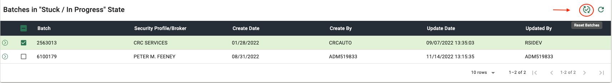
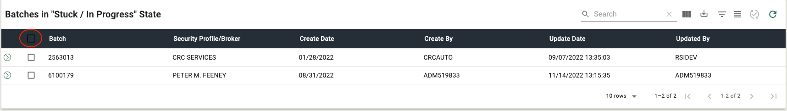
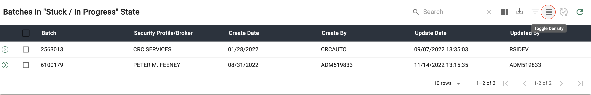
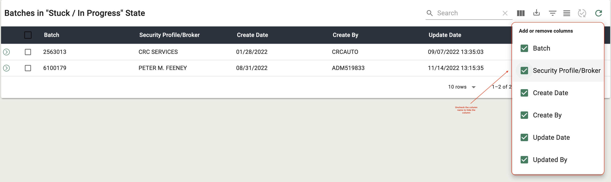

## Getting Started

<section markdown="1">

#### Overview

An application that provides new tools that will assist the ELANY Helpdesk to provide support to system users. These tools will utitlize various services to provide access into different components of the system and its data.

##### Background

On occassion, batches being submitted to ELANY get 'stuck' during the extensive data validation process. Currently, the Helpdesk can run a report, which identifies all the batches in this state. To 'reset' the batches the user needs to emeulate each brokerage, to successfully reset the batches. This process can be time-consuming when the number of batches is large. Easier access to batch submissions that have gotten 'stuck' will be provided in the Stuck Batches page. This page will reduce the time to identify, and reset the batches. The new interface will provide a list that covers all brokers, with mulitple selection and reset capabilities.

##### Purpose

While doing business, brokers are required to submit batches to ELANY for processing, whether submitted via a programmatic filing interface or manual entry. Batches and their transactional content are reviewed by the Affidavit system prior to submission to the examiner workflow. On occasion, issues are encountered during this data validation step that might leave a batch in a state that makes them inaccessible to the users. These _'stuck'_ batches need to be reset by the helper to allow the user to successfully re-submit them to ELANY.

</section>

---

<section markdown="1">

#### Launching from EEFS

1. Log in to the ELANY Electronic Filing System.

2. Click on the **STUCK BATCHES** button in the side navigation located under the **HELPDESK** section in the side navigation. _(Figure 1)_.

3. The Stuck Batches page will launch in the main window of the Affidavit Site. _(Figure 1)_.

###### _Figure 1 - Launching the Stuck Batches Page from EEFS_

</section>

---

## Stuck Batches

<section markdown="1">

#### Batch Details

The user will be able to access details about the items in the batch by using the **SHOW DETAILS** icon located on the left-hand side of each primary row, as shown in Figure 2. The user will able to see the _Item Number, Affidavit Number, Policy Number, Insured Name, Transaction Type, Premium and Inception Date_ for each item in the batch, as shown in Figure 3.

###### _Figure 2 - Accessing Batch Details_

###### _Figure 3 - Viewing Batch Details_

## </section>

<section markdown="1">

#### Reset Batch

##### Resetting a Single Batch - Procedure Summary

1. Check the checkbox next to the batch to reset, as shown in Figure 4.

2. Click the **RESET** icon button in the top right-hand side of the table toolbar, as shown in Figure 5.

###### _Figure 4 - Checking a Single Batch to Reset_

###### _Figure 5 - Resetting a Single Batch_

##### Resetting Multiple Batches - Procedure Summary

1. Check the checkbox next to each batch you wish to reset or click the check all checkbox next to the **BATCH** column header, as shown in Figure 6.

2. Click the **RESET** icon button in the top right-hand side of the table toolbar, as shown in Figure 7.

###### _Figure 6 - Checking Multiple Batches to Reset_

###### _Figure 7 - Resetting Multiple Batches_

## </section>

<section markdown="1">

#### Refresh Batches

The **REFRESH** button located in the table toolbar, as shown in Figure 8, is always available and provides the user with the means to refresh the results displayed in the table. This option will allow the user to get an updated list without the need to close and reopen the form. As the reuslts are being refreshed, any information displayed in the batch information section will be cleared.

###### _Figure 8 - Refreshing the Stuck Batches Table_

</section>

---

<section markdown="1">

#### Other Table Features

##### Table Density

The user will be able to toggle the density of the table rows by clicking the **TOGGLE DENSITY** icon button located in the top right hand corner of the table, shown in Figure 9. By default the table rows are set to dense so toggling the density will make the table rows larger as shown in Figure 10. To reset the table density to default click the **TOGGLE DENSITY** icon button again.

###### _Figure 9 - Toggle Table Density Icon Button / Table Density Default_

###### _Figure 10 - Table Density Normal_

##### Filtering Results

The user will be able to filter the result set by clicking the **SHOW FILTERS** icon button located next to the **TOGGLE DENSITY** icon button, shown in Figure 11. Once the filters are visible the user can filter by column to narrow down the result set. The user will select a column to filter the set by, as shown in Figure 12. Then use the input associated with that column to filter the result set by selected column for the search term entered into the input, as shown in Figure 13. To return to the default data set and remove the filter inputs, click the **SHOW FILTERS** icon button again, although the tooltip will now say **Hide Filters**, as shown in Figure 14.

###### _Figure 11 - Show Filters Icon Button_

###### _Figure 12 - Filter by Selected Column_

###### _Figure 13 - Filtered Result Set_

###### _Figure 14 - Hide Filter Inputs_

##### Exporting Results

The user will be able to export the result set by clicking the **EXPORT** icon button located next to the **SHOW FILTERS** icon button, shown in Figure 15. Once the button is clicked the user will have the option to export the result set as a PDF or a CSV, as shown in Figures 16 & 17.

_Note: Any other table actions taken before exporting the result set such as filtering, searching, hiding table columns will affect the results that show up in the exported data._

###### _Figure 15 - Export Icon Button_

###### _Figure 16 - Export as PDF_

###### _Figure 17 - Export as CSV_

##### Showing / Hiding Columns

The user will be able to show and hide columns using the **SHOW COLUMNS** icon button located next to the **EXPORT** icon button, shown in Figure 18. Once the icon button is clicked the user can uncheck the columns they wish to hide from the table shown in Figures 19 & 20.

###### _Figure 18 - Show Columns Icon Button_

###### _Figure 19 - Column Name Checklist_

###### _Figure 20 - Hide Premium Column_

##### Searching Results

The user will be able to search the table results by using the **SEARCH** input located in the table toolbar, shown in Figure 21. The search will differ from the filter inputs by the ability to search every column in the table for the search term instead of a single column, as shown in Figure 22.

###### _Figure 21 - Table Search Input_

###### _Figure 22 - Search Table by Search Term_

## </section>

<button id="scroll" onclick="scrollToTop()">
<svg xmlns="http://www.w3.org/2000/svg" height="24" viewBox="0 0 24 24" width="24">
<path d="M0 0h24v24H0z" fill="none"/>
<path d="M7.41 15.41L12 10.83l4.59 4.58L18 14l-6-6-6 6z" fill="rgb(231, 233, 231)"/>
</svg>
</button>

<title>AEROS Helpdesk User Guides</title>
<link rel="icon" href="../../assets/favicon.ico" />
<!-- <link markdown="1" rel="stylesheet" type="text/css" href="../../assets/css/styles.css" /> -->
<link markdown="1" rel="stylesheet" type="text/css" href="../../assets/css/aeros-components.css" />
<link rel="preconnect" href="https://fonts.googleapis.com">
<link rel="preconnect" href="https://fonts.gstatic.com" crossorigin>
<link href="https://fonts.googleapis.com/css2?family=Roboto:ital,wght@0,300;0,400;0,500;0,700;1,300;1,400;1,500;1,700&display=swap" rel="stylesheet">
<link markdown="1" rel="stylesheet" href="https://cdnjs.cloudflare.com/ajax/libs/font-awesome/5.15.3/css/all.min.css" integrity="sha512-iBBXm8fW90+nuLcSKlbmrPcLa0OT92xO1BIsZ+ywDWZCvqsWgccV3gFoRBv0z+8dLJgyAHIhR35VZc2oM/gI1w==" crossorigin="anonymous" />
<link href="https://fonts.googleapis.com/icon?family=Material+Icons" rel="stylesheet"/>

<!--  -->

