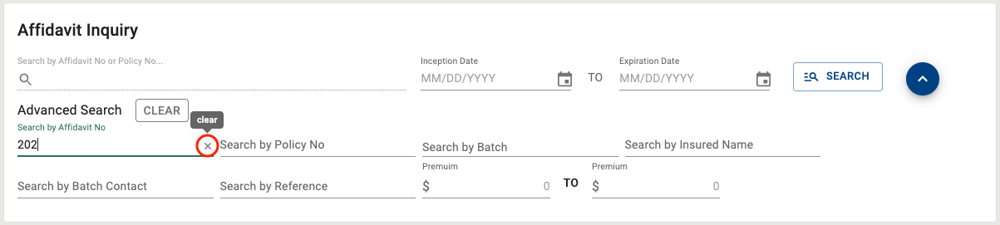
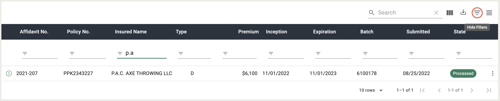

## Getting Started

<section markdown="1">

#### Overview

An application that provides new tools that will assist the Brokers to conduct searches for affidavits, declining companies, producing broker and life broker within the ELANY Electronic Filing System. These tools will utitlize various services to provide access into different components of the system and its data.

##### Purpose

Currently, in the Affidavit subpage users can search by Affidavit Number, Policy Number, Insured Name, or Batch Number. Users are limited to choose one of the search criteria and currently cannot search using multiple criteria. Results are displayed in a table beneath the search input and are sortable by Affidavit No, Policy No, Insured Name, Transaction Type, Inception Date, Expiration Date, Premium, Batch No, Date of Submission, and Processing State. Once a user receives a result set, the set cannot be further filtered and child and parent transactions are not connected in the result set.

This new subpage would improve search efficiency for EEFS users and provide the broker with a historical perspective on the activity that has occurred on an affidavit.

</section>

---

<section markdown="1">

#### Launching from EEFS

1. Log in to the ELANY Electronic Filing System.

2. Click on the **AFFIDAVIT** button in the side navigation located under the **INQUIRY** section in the side navigation. _(Figure 1)_.

3. The Affidavit Inquiry page will launch in the main window of the Affidavit Site. _(Figure 1)_.

###### _Figure 1 - Launching the Application_

</section>

---

## Affidavit Search

<section markdown="1">

#### Quick Search

For quick searches, the user can utilize the quick search controls, including the Search by Affidavit Number or Policy Number, Inception and Expiration date range. _(Figure 2)_.

##### Procedure Summary

1. Type in the Search by Affidavit No or Policy No input and then press **ENTER** or click the **SEARCH BUTTON**. _(Figure 2)_.

2. Further filter the search by entering an Inception Date and Expiration Date and then pressing **ENTER** or click the **SEARCH BUTTON**. _(Figure 3)_.

###### _Figure 2 - Quick Search - Search by Affidavit No or Policy No_

###### _Figure 3 - Quick Search - Inception and Expiration Date Range_

</section>

---

<section markdown="1">

#### Advanced Search

The advanced search feature allows for the user to execute more refined searches. The user will click the **ADVANCED SEARCH** button to the right of the **SEARCH** button, _(Figure 4)_, to view the advanced search inputs. The advanced search will allow the user to enter specific search conditions, including Affidavit No, Policy No, Insured Name, Batch No, Batch Contact, Reference, or a Premium Range.

###### _Figure 4 - Advanced Search Inputs_

##### Procedure Summary - Clearing Advanced Search

1. To clear all the search inputs click the **CLEAR** button to the right of the Advanced Search label. _(Figure 5)_.

2. To clear a single input click the **X** button to the right of the input. _(Figure 6)_.

###### _Figure 5 - Advanced Search - Clear All Inputs_

###### _Figure 6 - Advanced Search - Clear Single Input_

 </section>

---

<section markdown="1">

## Affidavit Details

#### Transaction Details

Users can access additional transaction details by clicking the kebab icon at the end of each row, as shown in Figures 7 & 8. The transaction detail panel includes a **VIEW AFFIDAVIT** button in the bottom right corner (as shown in Figure 9), which enables users to view the affidavit transaction.

###### _Figure 7 - Viewing Affidavit Details Card_

###### _Figure 8 - Viewing Affidavit Details of Related Child Transactions_

###### _Figure 9 - View Button Located in the Affidavit Details Card_

#### Batch Details

Transactions with additional batch information display a blue info icon next to the batch number. Users can view the message by clicking the icon, as shown in Figure 10.

###### _Figure 10 - Additional Batch Detail Card_

#### Transaction Message

Transactions with transaction messages display a blue info icon next to the affidavit number. Users can view the message by clicking the icon, as shown in Figure 11.

###### _Figure 11 - Transaction Message Card_

#### Related Transactions

If there are any child transactions available for the transaction in the table, the user can expand the rows by clicking on the down arrow on the left-hand side of the row, as shown in Figures 12 & 13. Clicking on the drop down arrow again will hide the child transaction rows for the transaction.

###### _Figure 12 - Related Transactions Button_

###### _Figure 13 - Related Child Transaction Rows_

</section>

---

## Affidavit Table

<section markdown="1">

#### Affidavit Table Features

##### Table Density

The user will be able to toggle the density of the table rows by clicking the **TOGGLE DENSITY** icon button located in the top right hand corner of the table, shown in Figure 14. By default the table rows are set to dense so toggling the density will make the table rows larger as shown in Figure 15. To reset the table density to default click the **TOGGLE DENSITY** icon button again.

###### _Figure 14 - Toggle Table Density Icon Button / Table Density Default_

###### _Figure 15 - Table Density Normal_

##### Filtering Results

The user will be able to filter the result set by clicking the **SHOW FILTERS** icon button located next to the **TOGGLE DENSITY** icon button, shown in Figure 16. Once the filters are visible the user can filter by column to narrow down the result set. The user will select a column to filter the set by, as shown in Figure 17. Then use the input associated with that column to filter the result set by selected column for the search term entered into the input, as shown in Figure 18. To return to the default data set and remove the filter inputs, click the **SHOW FILTERS** icon button again, although the tooltip will now say **HIDE FILTERS**, as shown in Figure 19.

###### _Figure 16 - Show Filters Icon Button_

###### _Figure 17 - Filter by Selected Column_

###### _Figure 18 - Filtered Result Set_

###### _Figure 19 - Hide Filter Inputs_

##### Exporting Results

The user will be able to export the result set by clicking the **EXPORT** icon button located next to the **SHOW FILTERS** icon button, shown in Figure 20. Once the button is clicked the user will have the option to export the result set as a PDF or a CSV, as shown in Figures 21 & 22.

_Note: Any other table actions taken before exporting the result set such as filtering, searching, hiding table columns will affect the results that show up in the exported data._

###### _Figure 20 - Export Icon Button_

###### _Figure 21 - Export as PDF_

###### _Figure 22 - Export as CSV_

##### Showing Hiding Columns

The user will be able to show and hide columns using the **SHOW COLUMNS** icon button located next to the **EXPORT** icon button, shown in Figure 23. Once the icon button is clicked the user can uncheck the columns they wish to hide from the table shown in Figures 24 & 25.

###### _Figure 23 - Show Columns Icon Button_

###### _Figure 24 - Column Name Checklist_

###### _Figure 25 - Hide Policy No. Column_

##### Searching Results

The user will be able to search the table results by using the **SEARCH** input located in the table toolbar, shown in Figure 26. The search will differ from the filter inputs by the ability to search every column in the table for the search term instead of a single column, as shown in Figure 27.

###### _Figure 26 - Table Search Input_

###### _Figure 27 - Search Table by Search Term_

##### Sort Results

The user can sort results by column by clicking the SORT button, which is represented by an arrow icon that appears when the user hovers over one of the table column headers, as shown in Figure 28.

###### _Figure 28 - Sort by Column_

##### Table Rows Per Page

Users can modify the maximum number of rows displayed per page (default 10 rows) using the **ROWS PER PAGE** dropdown in the table footer, as shown in Figure 29. By clicking the dropdown menu, users can change the maximum number of rows to 25, 50, or 100, as illustrated in Figure 30.

###### _Figure 29 - Table Rows Per Page_

###### _Figure 30 - Table Rows Per Page Menu_

##### Table Navigation

Users can navigate the table using the navigation buttons located on the right of the table footer. The current page and total number of pages are displayed between the **ROWS PER PAGE** dropdown and the navigation buttons, as shown in Figure 31.

To go to the next/previous page, the user can click the **NEXT/BACK BUTTON**, as depicted in Figure 32.

To go to the first/last page, the user can click the **SKIP TO FIRST/LAST PAGE BUTTON** located outside the **NEXT/BACK BUTTON**, as shown in Figure 33.

###### _Figure 31 - Current Page and Page Total_

###### _Figure 32 - Next/Back button_

###### _Figure 33 - Skip to First/Last button_

</section>

<button id="scroll" onclick="scrollToTop()">
<svg xmlns="http://www.w3.org/2000/svg" height="24" viewBox="0 0 24 24" width="24">
<path d="M0 0h24v24H0z" fill="none"/>
<path d="M7.41 15.41L12 10.83l4.59 4.58L18 14l-6-6-6 6z" fill="rgb(231, 233, 231)"/>
</svg>
</button>

<title>AEROS Affidavit Inquiry</title>
<link rel="icon" href="../../assets/favicon.ico" />
<!-- <link markdown="1" rel="stylesheet" type="text/css" href="../../assets/css/styles.css" /> -->
<link markdown="1" rel="stylesheet" type="text/css" href="../../assets/css/aeros-components.css" />
<link rel="preconnect" href="https://fonts.googleapis.com">
<link rel="preconnect" href="https://fonts.gstatic.com" crossorigin>
<link href="https://fonts.googleapis.com/css2?family=Roboto:ital,wght@0,300;0,400;0,500;0,700;1,300;1,400;1,500;1,700&display=swap" rel="stylesheet">
<link markdown="1" rel="stylesheet" href="https://cdnjs.cloudflare.com/ajax/libs/font-awesome/5.15.3/css/all.min.css" integrity="sha512-iBBXm8fW90+nuLcSKlbmrPcLa0OT92xO1BIsZ+ywDWZCvqsWgccV3gFoRBv0z+8dLJgyAHIhR35VZc2oM/gI1w==" crossorigin="anonymous" />
<link href="https://fonts.googleapis.com/icon?family=Material+Icons" rel="stylesheet"/>

<!--  -->

