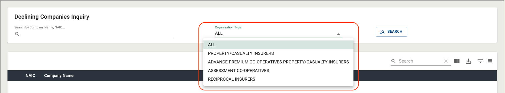
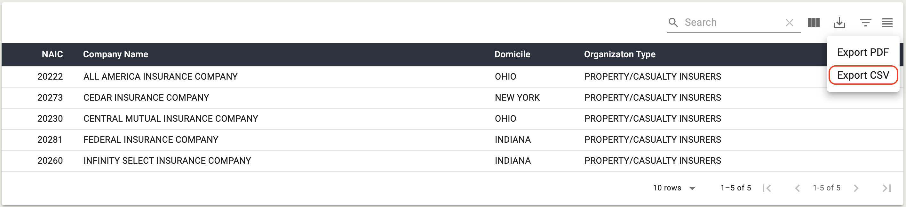

## Getting Started

#### Overview

An application that provides new tools that will assist the Brokers to conduct searches for affidavits, declining companies, producing broker and life broker within the ELANY Electronic Filing System. These tools will utitlize various services to provide access into different components of the system and its data.

##### Purpose

Users will now have the ability to search by Company Name, NAIC code or by Organization Type. This new subpage will enhance search capabilities for users by allowing users to use the first three letters or digits when conducting their search, adding an Organization Type input that can be used in conjunction with the Company Name and NAIC search, adding new columns to the result set with would now include Company Name, NAIC, Organization Type, and Domicile, and the ability to further filter and sort the result set.

#### Launching from EEFS

1. Log in to the ELANY Electronic Filing System.

2. Click on the **DECLINING COMPANIES** button in the side navigation located under the **INQUIRY** section in the side navigation. _(Figure 1)_.

3. The Declining Company page will launch in the main window of the Affidavit Site. _(Figure 1)_.

##### _Figure 1 - Launching the Application_

<!-- Update launching the application text -->

</section>

---

## Declining Companies Search

<section markdown="1">

#### Company Name NAIC Code Search

Users will be able to search for declining companies by company name or NAIC code using the first three letters or digits of each. There will also be the ability to search by organization type using the organization type dropdown, shown in _(Figure 2)_. Users can use these two search options individually or in conjunction.

After entering their search criteria, users will click the **SEARCH** button or press **ENTER** and the results will be displayed in table format, shown in _(Figure 3)_.

##### _Figure 2 - Organization type dropdown menu_

##### _Figure 3 - Declining Companies search results_

<!-- add text for search input -->

</section>

---

## Declining Companies Table

<section markdown="1">

#### Declining Companies Table Features

##### Table Density

The user will be able to toggle the density of the table rows by clicking the **TOGGLE DENSITY** icon button located in the top right hand corner of the table, shown in Figure 4. By default the table rows are set to dense so toggling the density will make the table rows larger as shown in Figure 5. To reset the table density to default click the **TOGGLE DENSITY** icon button again.

###### _Figure 4 - Toggle Table Density Icon Button / Table Density Default_

###### _Figure 5 - Table Density Normal_

##### Filtering Results

The user will be able to filter the result set by clicking the **SHOW FILTERS** icon button located next to the **TOGGLE DENSITY** icon button, shown in Figure 6. Once the filters are visible the user can filter by column to narrow down the result set. The user will select a column to filter the set by, as shown in Figure 7. Then use the input associated with that column to filter the result set by selected column for the search term entered into the input, as shown in Figure 8. To return to the default data set and remove the filter inputs, click the **SHOW FILTERS** icon button again, although the tooltip will now say **Hide Filters**, as shown in Figure 9.

###### _Figure 6 - Show Filters Icon Button_

###### _Figure 7 - Filter by Selected Column_

###### _Figure 8 - Filtered Result Set_

###### _Figure 9 - Hide Filter Inputs_

##### Exporting Results

The user will be able to export the result set by clicking the **EXPORT** icon button located next to the **SHOW FILTERS** icon button, shown in Figure 10. Once the button is clicked the user will have the option to export the result set as a PDF or a CSV, as shown in Figures 11 & 12.

_Note: Any other table actions taken before exporting the result set such as filtering, searching, hiding table columns will affect the results that show up in the exported data._

###### _Figure 10 - Export Icon Button_

###### _Figure 11 - Export as PDF_

###### _Figure 12 - Export as CSV_

##### Showing Hiding Columns

The user will be able to show and hide columns using the **SHOW COLUMNS** icon button located next to the **EXPORT** icon button, shown in Figure 13. Once the icon button is clicked the user can uncheck the columns they wish to hide from the table shown in Figures 14 & 15.

###### _Figure 13 - Show Columns Icon Button_

###### _Figure 14 - Column Name Checklist_

###### _Figure 15 - Hide Company Name Column_

##### Searching Results

The user will be able to search the table results by using the **SEARCH** input located in the table toolbar, shown in Figure 16. The search will differ from the filter inputs by the ability to search every column in the table for the search term instead of a single column, as shown in Figure 17.

###### _Figure 16 - Table Search Input_

###### _Figure 17 - Search Table by Search Term_

##### Sort Results

The user can sort results by column by clicking the SORT button, which is represented by an arrow icon that appears when the user hovers over one of the table column headers, as shown in Figure 18.

###### _Figure 18 - Table Sort_

##### Table Rows Per Page

Users can modify the maximum number of rows displayed per page (default 10 rows) using the **ROWS PER PAGE** dropdown in the table footer, as shown in Figure 19. By clicking the dropdown menu, users can change the maximum number of rows to 25, 50, or 100, as illustrated in Figure 20.

###### _Figure 19 - Table Rows Per Page_

###### _Figure 20 - Table Rows Per Page Menu_

##### Table Navigation

Users can navigate the table using the navigation buttons located on the right of the table footer. The current page and total number of pages are displayed between the **ROWS PER PAGE** dropdown and the navigation buttons, as shown in Figure 21.

To go to the next/previous page, the user can click the **NEXT/BACK BUTTON**, as depicted in Figure 22.

To go to the first/last page, the user can click the **SKIP TO FIRST/LAST PAGE BUTTON** located outside the **NEXT/BACK BUTTON**, as shown in Figure 23.

###### _Figure 21 - Current Page and Page Total_

###### _Figure 22 - Next/Back Button_

###### _Figure 23 - Skip to First/Last Button_

</section>

<button id="scroll" onclick="scrollToTop()">
<svg xmlns="http://www.w3.org/2000/svg" height="24" viewBox="0 0 24 24" width="24">
<path d="M0 0h24v24H0z" fill="none"/>
<path d="M7.41 15.41L12 10.83l4.59 4.58L18 14l-6-6-6 6z" fill="rgb(231, 233, 231)"/>
</svg>
</button>

<title>AEROS Declining Companies Inquiry</title>
<link rel="icon" href="../../assets/favicon.ico" />
<!-- <link markdown="1" rel="stylesheet" type="text/css" href="../../assets/css/styles.css" /> -->
<link markdown="1" rel="stylesheet" type="text/css" href="../../assets/css/aeros-components.css" />
<link rel="preconnect" href="https://fonts.googleapis.com">
<link rel="preconnect" href="https://fonts.gstatic.com" crossorigin>
<link href="https://fonts.googleapis.com/css2?family=Roboto:ital,wght@0,300;0,400;0,500;0,700;1,300;1,400;1,500;1,700&display=swap" rel="stylesheet">
<link markdown="1" rel="stylesheet" href="https://cdnjs.cloudflare.com/ajax/libs/font-awesome/5.15.3/css/all.min.css" integrity="sha512-iBBXm8fW90+nuLcSKlbmrPcLa0OT92xO1BIsZ+ywDWZCvqsWgccV3gFoRBv0z+8dLJgyAHIhR35VZc2oM/gI1w==" crossorigin="anonymous" />
<link href="https://fonts.googleapis.com/icon?family=Material+Icons" rel="stylesheet"/>

<!--  -->

