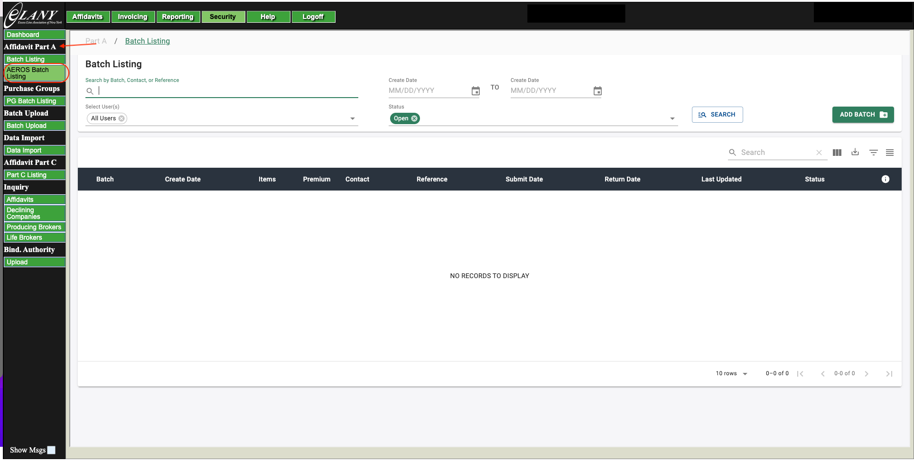
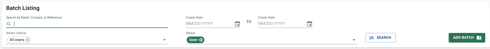
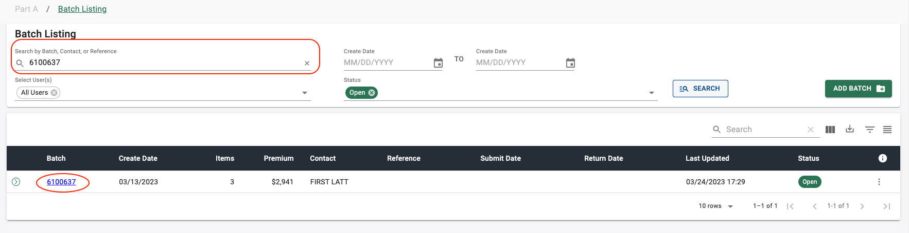
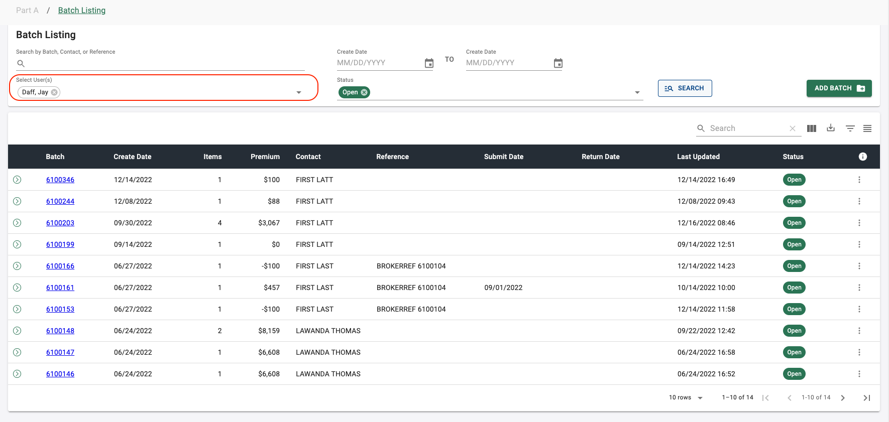
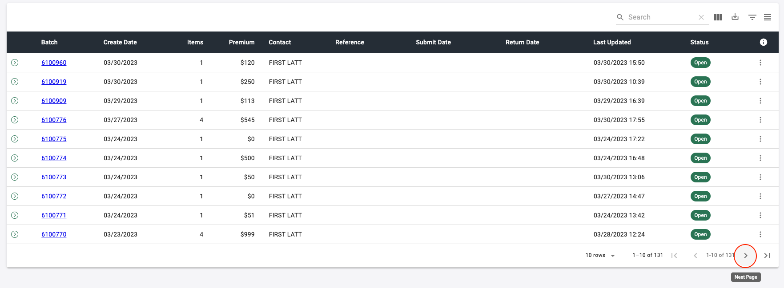
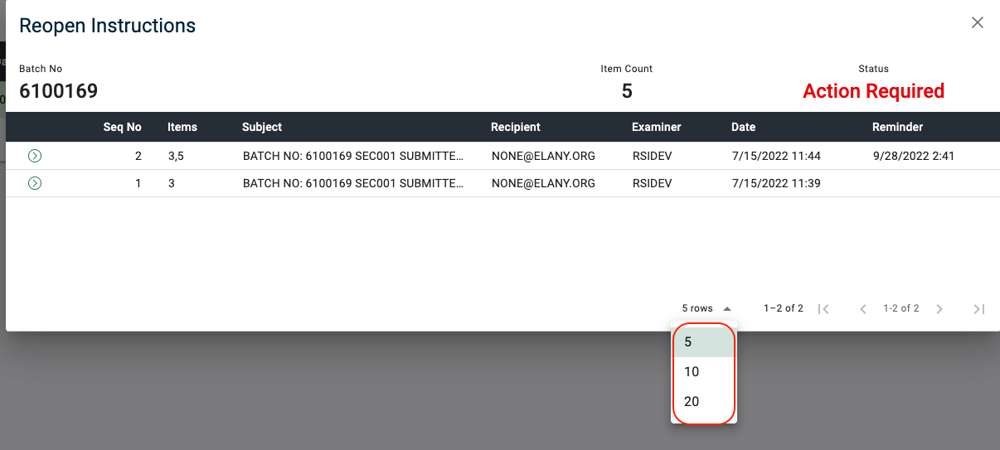
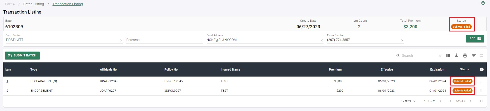

## Getting Started

#### Overview

As a part of the new AEROS Part A Subsystem, the new Batch Listing page has been given a technology refresh to update the look and feel of the current process, as well as provide the user with a more intuitive, efficient tools to navigate the Part A subsystem. The Batch Listing is separated into two sections - the search criteria and the results of the search in the Batch Listing table. When the Batch Listing is initially loaded, the search criteria will be set to the default settings, as shown in _Figure 1_. The search results set shown in the table will show batches in descending order with the most recently created batches at the top of the result set. Additionally, enhanced search features were addressed on the Batch Listing page to allow the user to quickly see only the batches they created and to preview the transactions in the batch without opening the batch.

###### _Figure 1 - Batch Listing Search Criteria & Search Results_

</section>

---

<section markdown="1">

#### Launching from EEFS

1. Log in to the ELANY Electronic Filing System.

2. Click on the **AEROS Batch Listing** button located under the **Affidavit Part A** section in the side navigation. _(Figure 2)_.

3. The Batch Listing page will launch in the main window of the Affidavit Site.

###### _Figure 2 - Launching the Batch Listing Page from the Affidavit Site_

</section>

---

## Batch Listing Search

When the Batch Listing is initially loaded, the search criteria will be set to the default settings, as shown in _Figure 3_. The user will be able to manipulate the default settings in several ways. The user will be able to search by Batch Number, Contact Name, or Batch Reference. The user can give the search a create date range to filter out batches that do not coincide with the dates given in the date range. The user can filter the batches created by a certain user or all users to appear in the result set. The user can filter batches by batch status to appear in the result set.

_Please note that if a user is authorized, they can see a list of all user(s) and the search criteria will default **Select User(s)** field to "All Users" else this field is defaulted to "My Batches" wherein they can only view the batches created by them._

###### _Figure 3 - Search Criteria Default Settings_

---

<section markdown="1">

#### Combo Search

The combo search allows the user to search for batches by Batch Number, Batch Contact, or Batch Reference. If a user would like to search by Batch Number, the user must input the entire batch number. If the user would like to search by Batch Contact or Batch Reference, the user must enter at least the first 3 letters of either category.

##### Procedure Summary - Search by Batch Number

1. Using the combo search input type in the entire batch number, as shown in _Figure 4_.

2. Click the **SEARCH** button located in the right-hand side of the search, as shown in _Figure 5_.

3. The result set will only include batches that are related to that batch number, as shown in _Figure 6_.

###### _Figure 4 - Combo Search - Search by Batch Number_

###### _Figure 5 - Search by Batch Number_

###### _Figure 6 - Search by Batch Number Results_

##### Procedure Summary - Search by Batch Contact or Reference

1. Using the combo search input, type in at least the first 3 letters for the search, as shown in _Figure 7_.

2. Click the **SEARCH** button located in the right-hand side of the search, as shown in _Figure 8_.

3. The result set will only include batches that contain a batch contact or reference based on the search criteria, as shown in _Figure 9_.

###### _Figure 7 - Combo Search - Search by Batch Contact or Reference_

###### _Figure 8 - Search by Batch Contact or Reference_

###### _Figure 9 - Search by Batch Contact or Reference Results_

</section>

---

<section markdown="1">

#### Create Date Range

The Create Date range can be entered to isolate the batches that were created between noted dates.

##### Procedure Summary

1. Click on the **CALENDAR** icon button in the starting date range to open the date picker, as shown in _Figure 10_.

2. Select the start date from the date picker, as shown in _Figure 11_.

3. Click on the **CALENDAR** icon button in the ending date range to open the date picker, as shown in _Figure 12_.

4. Select the end date from the date picker, as shown in _Figure 13_.

5. Click the **SEARCH** button located in the right-hand side of the search, as shown in _Figure 14_.

6. The result set will only include batches that were created in the date range selected, as shown in _Figure 15_. By default, the batches will be listed with the most current create date at the top of the list.

###### _Figure 10 - Calendar Icon on Starting Create Date_

###### _Figure 11 - Selecting Starting Create Date_

###### _Figure 12 - Calendar Icon on Ending Create Date_

###### _Figure 13 - Selecting Ending Create Date_

###### _Figure 14 - Searching by Create Date Range_

###### _Figure 15 - Create Date Range Search Results_

</section>

---

<section markdown="1">

#### Filter by User

The default setting for regular users will be set to _My Batches_, for admin users the default will be set to _All Users_. Multiple users can be selected using this input.

##### Procedure Summary

1. Click on the **SELECT USER(S)** dropdown menu, as shown in _Figure 16_.

2. Select the desired user from the dropdown list, as shown in _Figure 17_.

3. Click the **SEARCH** button located in the right-hand side of the search, as shown in _Figure 18_.

4. The result set will only include batches created by the selected user, as shown in _Figure 19_.

###### _Figure 16 - Select User(s) Dropdown_

###### _Figure 17 - Selecting a User from the Dropdown List_

###### _Figure 18 - Search by Selected User_

###### _Figure 19 - Search by Selected User Results_

</section>

---

<section markdown="1">

#### Filter by Batch Status

The default setting will be set to _Open_ batches, open batches are batches that are actively being worked on and/or has not been submitted to ELANY. Multiple statuses can be selected using this input.

##### Procedure Summary

1. Click on the **STATUS** dropdown, as shown in _Figure 20_.

2. Select the desired batch status to filter the search criteria, as shown in _Figure 21_.

3. Clcik the **SEARCH** button located in the right-hand side of the search, as shown in _Figure 22_.

4. The result set will only include batches that are in the selected batch status state, as shown in _Figure 23_.

###### _Figure 20 - Batch Status Dropdown_

###### _Figure 21 - Selecting a Batch Status from the Dropdown List_

###### _Figure 22 - Search by Selected Batch Status_

###### _Figure 23 - Search by Selected Batch Status Results_

</section>

---

## Batch Listing Table

The search results shown in the table will show batches in descending order with the most recently created batches at the top of the result set.

<section markdown="1">

#### Batch Status Descriptions

The Batch Status Description legend can be viewed by clicking the information icon button next to the **STATUS** column in the table, as shown in _Figures 24 & 25_.

###### _Figure 24 - View Batch Status Descriptions Icon Button_

###### _Figure 25 - Batch Status Descriptions Dialog_

</section>

---

<section markdown="1">

#### Table Density

The user will be able to toggle the density of the table from dense to normal density, making the table rows bigger or smaller based on the user preference. The table will default to **DENSE** setting.

##### Procedure Summary

1. Click the **TOGGLE DENSITY** icon button located in the top right-hand corner of the table, as shown in _Figure 26_.

2. The table rows will enlarge to the **NORMAL** density setting, as shown in _Figure 27_.

3. Click the **TOGGLE DENSITY** icon button again to string the table rows to the **DENSE** setting.

###### _Figure 26 - Toggle Density Icon Button_

###### _Figure 27 - Normal Density Setting_

</section>

---

<section markdown="1">

#### Filtering Results

The user will be able to filter the result set using the **SHOW FILTERS** icon button, to enable text inputs. Once the filters are visible the user can filter by column to narrow down the result set.

##### Procedure Summary

1. Click the **SHOW FILTERS** icon button located in the top right-hand corner of the table, as shown in _Figure 28_.

2. This will enable the filter inputs below each column header, as shown in _Figure 29_.

3. Type in the search term into the selected input associated with the column to filter the result set, as shown in _Figure 30_.

4. To return to the default data set and remove the filter inputs, click the **HIDE FILTERS** icon button again, as shown in _Figure 31_.

###### _Figure 28 - Show Filters Icon Button_

###### _Figure 29 - Filter Inputs_

###### _Figure 30 - Filtered Result Set_

###### _Figure 31 - Hide Filters Icon Button_

</section>

---

<section markdown="1">

#### Exporting Results

The user will be able to export the result set from the table in the form of a PDF or CSV file. The file will contain all rows associated with the result set.

##### Procedure Summary

1. Click the **EXPORT** icon button located in the top right-hand corner of the table, as shown in _Figure 32_.

2. Select the file type for the export from the dropdown list as shown in _Figure 33_.

###### _Figure 32 - Export Icon Button_

###### _Figure 33 - Export File Type Choices_

</section>

---

<section markdown="1">

#### Showing / Hiding Columns

The user will be able to manipulate the table by choosing which columns they want to show and hide in the result set. The default will be to show all the columns.

##### Procedure Summary

1. Click the **SHOW COLUMNS** icon button located in the top right-hand corner of the table, as shown in _Figure 34_.

2. A dropdown list will appear, and the user will be able to uncheck the columns they wish to hide and check the columns they want to be visible in the table, as shown in _Figure 35_.

###### _Figure 34 - Show Columns Icon Button_

###### _Figure 35 - Hiding the Items Column from the Table_

</section>

---

<section markdown="1">

#### Searching Results

The user will be able to search the result set for a search term, this differs from the filter feature by the ability for the user to search every column in the table for a specific term.

##### Procedure Summary

1. Use the **SEARCH** input located in the top right-hand corner of the table, as shown in Figure 36.

2. Enter the search term into the input and the result set will filter based on the search term, as shown in Figure 37.

3. To return to the original result set click the **X** icon button in the right-hand side of the search input, as shown in Figure 38.

###### _Figure 36 - Search Input_

###### _Figure 37 - Filtered Result Set_

###### _Figure 38 - Clear Search_

</section>

---

<section markdown="1">

#### Table Rows Per Page

The user will be able to manipulate how many rows are visible at one time using the **ROWS PER PAGE** dropdown in the table footer. The user can change the maximum visible rows to 10, 20, 40, 60, 80, or 100. The default will be set to show 10 rows.

##### Procedure Summary

1. Click the **ROWS PER PAGE** dropdown located in the table footer, as shown in _Figure 39_.

2. Select the option for maximum rows per page from the dropdown list, as shown in _Figure 40_.

###### _Figure 39 - Rows Per Page Select_

###### _Figure 40 - Rows Per Page Options_

</section>

---

<section markdown="1">

#### Table Navigation

The user will be able to navigate through the rows using the navigation buttons located in the table footer. The user will be able to go to the **FIRST PAGE**, **PREVIOUS PAGE**, **NEXT PAGE**, and **LAST PAGE** using the navigation buttons.

##### Procedure Summary

1. Click the **NEXT PAGE** button to navigate to the next page in the result set, as shown in _Figure 41_.

2. Click the **LAST PAGE** button to navigate to the last page in the result set, as shown in _Figure 42_.

3. Click the **PREVIOUS PAGE** button to navigate to the previous page in the result set, as shown in _Figure 43_.

4. Click the **FIRST PAGE** button to navigate to the first page in the result set, as shown in _Figure 44_.

###### _Figure 41 - Next Page Navigation Button_

###### _Figure 42 - Last Page Navigation Button_

###### _Figure 43 - Previous Page Navigation Button_

###### _Figure 44 - First Page Navigation Button_

</section>

---

## Add Batch

The user will be able to create a new batch from the Batch Listing page.

#### Procedure Summary

1. Click on the green **‘ADD BATCH’** button on the upper right-hand side of the Batch Listing page, next to the ‘SEARCH’ button, as shown in _Figure 44a_.

2. The Transaction Menu page is displayed with a variety of transactions that may be added to the batch, as shown in _Figure 44b_.

3. The user may choose one of the available types of transactions from the transaction menu to continue. For more details, please click on the links provided below.

4. Once the transaction is successfully created, a batch number is assigned to that transaction and a new batch is successfully created.

[Add Endorsement](/guides/parta/endorsement-transactions#add-endorsement)

[Add New Transaction](/guides/parta/new-transactions#add-transaction)

[Add NOC Transaction](/guides/parta/noc-transactions#add-noc-transaction)

[Add Renewal Transaction](/guides/parta/renewal-transactions#add-renewal-transaction)

[Add Suspense Resubmission Transaction](/guides/parta/suspense-transactions#add-suspense-transaction)

[Add Stamp Only Transaction](/guides/parta/stamp-only-transactions#add-stamp-only-transaction)

[Add CBOR Transaction](/guides/parta/cbor-transactions#add-cbor-transaction)

[Add Reverse CBOR Transaction](/guides/parta/reverse-cbor-transactions#add-reverse-bor-transaction)

###### _Figure 44a - 'ADD BATCH' Button_

###### _Figure 44b - Transaction Menu: Choose Transaction to Add_

---

## Batch Details

<section markdown="1">

#### Viewing Transactions

The user will be able to preview all the transactions within a batch from the search results (or Batch Listing Page) and then view transaction details from here.

##### Procedure Summary

1. Click the right arrow located in front of the batch in the search results.

2. This will drop down the arrow and display all the transactions for the chosen batch, as shown in _Figure 45a_. Notice how the batch being viewed is highlighted. Notice the bolded letter (N, R, SR) in front of some of these transactions. When you hover over the letter it will display a tooltip indicating if the transaction is New, Renewal or Suspense Resubmission as shown in _Figures 45b, 45c and 45d_.

3. If you would like to preview the transactions of another batch, simply click on the right arrow located in front of the corresponding batch. This will close the preview of the batch being currently viewed and open the preview of the selected batch. The user may also click the down arrow, collapse the batch and the preview of the transactions will disappear.

4. To click on a specific transaction (or item) within a batch, click on the corresponding item number link, as shown in _Figure 46_.

5. This will take the user to the transaction details page, as shown in _Figure 47_. The user may then use the drop-down arrow to view specific details of the transaction.

6. Click on ‘Batch Listing’ within the breadcrumbs that appear on the top left corner of the screen, to go back to the batch listing (search) page, as shown in _Figure 48_.

###### _Figure 45a - Preview Transactions within a Batch_

###### _Figure 45b - 'New' Transaction Tooltip_

###### _Figure 45c - 'Renewal' Transaction Tooltip_

###### _Figure 45d - 'Suspense Resubmission' Transaction Tooltip_

###### _Figure 46 - Click to View Transaction Details_

###### _Figure 47 - Transaction Details_

###### _Figure 48 - Select 'Batch Listing' in Breadcrumbs_

</section>

---

<section markdown="1">

#### Edit Batch

The user will be able to edit a batch from the batch listing page.

_Please note that an edit can be performed only on a batch that is in an ‘Open’, ‘Submit Failed’ and ‘Action Required’ batch status._

##### Procedure Summary

1. Click on the Kebab menu (3 vertical ellipses) located at the far end of the batch in the search results, as shown in _Figure 49_.

2. Select the **‘Edit’** option from the pop-up menu, as shown in _Figure 50_.

3. This will take the user to the transaction listing page which lists all the transactions within the batch, as shown in _Figure 51_.

4. The user may then add a new transaction to the batch, edit or delete an existing transaction within a batch. Please refer to [link](/guides/parta/new-transactions) for more details.

5. Additionally, the user may also edit the Batch level details - Batch Contact, Reference, Email address, and Phone Number associated with the batch. Please refer to [link](/guides/parta/transaction-listing#batch-information) for more details.

[Edit Endorsement Transaction](/guides/parta/endorsement-transactions#edit-endorsement)

[Edit New Transaction](/guides/parta/new-transactions#edit-new-transaction)

[Edit NOC Transaction](/guides/parta/noc-transactions#edit-noc-transaction)

[Edit Renewal Transaction](/guides/parta/renewal-transactions#edit-renewal-transaction)

[Edit Suspense Resubmission Transaction](/guides/parta/suspense-transactions#edit-suspense-transaction)

[Edit Stamp Only Transaction](/guides/parta/stamp-only-transactions#edit-stamp-only-transaction)

[Edit CBOR Transaction](/guides/parta/cbor-transactions#edit-cbor-transaction)

[Edit Reverse CBOR Transaction](/guides/parta/reverse-cbor-transactions#edit-reverse-bor-transaction)

###### _Figure 49 - Kebab Menu_

###### _Figure 50 - Selecting Edit from the Pop-up Menu_

###### _Figure 51 - Edit Batch from Transaction Listing_

</section>

---

<section markdown="1">

#### View Batch

The user will be able to view the details of a batch from the batch listing page.

##### Procedure Summary

1. Click on the batch number link of the batch you would like to view, as shown in _Figure 52_.

2. This will take the user to the batch details (transaction listing page) which lists all the details of the batch, as shown in _Figure 53_.

3. Alternately, click on the Kebab menu (3 vertical ellipses) located at the far end of the batch you would like to view, as shown in _Figure 54_.

4. Select either **‘Edit’** or **‘View’** option (displayed, depending on the batch status) from the pop-up menu as shown in _Figure 55 or 56_. This will also take the user to the batch details (transaction listing page), as shown in _Figure 53_.

###### _Figure 52 - Batch Number Link_

###### _Figure 53 - View Batch Details_

###### _Figure 54 - Kebab Menu_

###### _Figure 55 - Selecting Edit from Pop-up Menu_

###### _Figure 56 - Selecting View from Pop-up Menu_

</section>

---

<section markdown="1">

#### Print Batch

The user will be able to print the required documents (Batch Filing Report, all associated Part A’s and other relevant documents) of a batch from the batch listing page.

_Please note that a batch can be printed only if the batch status is in an ‘Open’, ‘Submitting’, ‘Submit Failed’, ‘Submitted’, ‘Examining’, ‘Action Required’ or any ‘Returned’ status._

##### Procedure Summary

1. Click on the Kebab menu (3 vertical ellipses) located at the far end of the batch in the search results, as shown in _Figure 57_.

2. Select the **‘Print’** option from the pop-up menu, as shown in _Figure 58_.

3. This will generate a PDF file, with all the documents needed for the filing, in a new window. This includes all applicable documents – Batch Filing Report (BFR), Part A’s, Tax Allocation, Part C’s, Notice of Excess Line Placement (NELP) and Total Cost Form.

4. Click on the Print icon located in the upper right-hand side of the window. Please ensure your computer is connected to a printer device.

###### _Figure 57 - Kebab Menu_

###### _Figure 58 - Selecting Print from the Pop-up Menu_

</section>

---

<section markdown="1">

#### Delete Batch

The user will be able to delete a batch from the batch listing page.

_Please note that a batch can only be deleted if the batch status is in an ‘Open’ or ‘Submit Failed’ status._

If the batch being deleted has a transaction that has dependent transactions in other batches, ensure that those transaction(s) have been deleted prior to deleting the batch.

##### Procedure Summary

1. Click on the Kebab menu (3 vertical ellipses) located at the far end of the batch in the search results, as shown in _Figure 63_.

2. Select the **‘Delete’** option from the pop-up menu, as shown in _Figure 64_.

3. A confirmation message will be presented as an overlay on top of the Batch Listing page, as shown in _Figure 65_, with two options displayed to the user – **‘Confirm’** or **‘Cancel’**.

4. Click on **‘Confirm’** to confirm the delete batch operation or **‘Cancel’** to cancel the delete batch operation.

5. If the user clicks **‘Confirm’**, the batch is deleted and a success message appears at the bottom right-hand corner of the screen, as shown in _Figure 66_.

6. If the user clicks **‘Cancel’**, the confirmation message closes, no changes are made, and the user remains on the Batch Listing page.

###### _Figure 63 - Kebab Menu_

###### _Figure 64 - Selecting Delete from the Pop-up Menu_

###### _Figure 65 - Delete Batch Confirmation Dialog_

###### _Figure 66 - Delete Batch Success Message_

</section>

---

<section markdown="1">

#### Reopen Instructions

The user will be able to access the “Instructions” sent by the ELANY Examiner for a batch that has been reopened, from the Batch Listing page. This will show them the details of the email correspondence received from the ELANY Examiner. Please note that this option is ONLY available for batches with an ‘Action Required’ batch status.

#### Procedure Summary

1. Using the search criteria in the Batch Listing page, locate the batch for which you would like to view the “Instructions”, from the ELANY Examiner.

2. Click on the Kebab menu (3 vertical ellipses) located at the far end of the batch in the search results, as shown in _Figure 67_.

3. Select the **‘Instructions’** option from the pop-up menu, as shown in _Figure 68_.

4. The ‘Reopen Instructions’ will be presented as an overlay on top of the Batch Listing page, as shown in _Figure 69_.

5. Click on the right arrow to view the instruction details, as shown in _Figure 70_, with the most recent one appearing at the top.

6. This will drop down the arrow and display the corresponding instruction details, as shown in _Figure 71_.

7. The user may click on the down arrow, as shown in _Figure 71_, to close the individual instruction details.

8. The user will also be able to manipulate the rows visible at a time using the ‘Rows’ dropdown arrow, as shown in _Figure 72_. Select the option for maximum rows per page from the dropdown list, as shown in _Figure 73_. The user may select from 5, 10 or 20 rows per page. The default will be set to show 5 rows.

9. In order to navigate through the rows, the user may use the navigation buttons located at the bottom of the page. Click on the **‘Next Page’** button to navigate to the next page in the result set, as shown in _Figure 74_. Click on the **‘Last Page’** button to navigate to the last page in the result set, as shown in _Figure 75_. Click on the **‘Previous Page’** button to navigate to the previous page in the result set, as shown in _Figure 76_. Click on the **‘First Page’** button to navigate to the first page in the result set, as shown in _Figure 77_.

10. The user may use the **‘X’** button on the ‘Reopen Instructions’ overlay page to close and go back to the Batch Listing page, as shown in _Figure 78_.

11. Alternately, ‘Reopen Instructions’ may be viewed from the Transaction Listing page as well. Please refer to this [link](/guides/parta/transaction-listing#reopen-instructions) for more information.

###### _Figure 67 - Kebab Menu_

###### _Figure 68 - Pop-up Menu: Instructions_

###### _Figure 69 - Reopen Instructions_

###### _Figure 70 - Click Right Arrow to View Details_

###### _Figure 71 - Instruction Details_

###### _Figure 72 - Rows Per Page Select_

###### _Figure 73 - Rows Per Page Options_

###### _Figure 74 - Next Page Navigation Button_

###### _Figure 75 - Last Page Navigation Button_

###### _Figure 76 - Previous Page Navigation Button_

###### _Figure 77 - First Page Navigation Button_

###### _Figure 78 - Close Reopen Instructions_

</section>

---

<section markdown="1">

#### Stamped Documents

The user will be able to access the stamped documents from the Batch Listing page for ALL the batches returned from ELANY. Please note that this option will ONLY be available for batches with any ‘Returned’ status.

#### Procedure Summary

1. Using the search criteria in the Batch Listing page, locate the batch for which you would like to access the stamped documents from ELANY.

2. Click on the Kebab menu (3 vertical ellipses) located at the far end of the batch in the search results, as shown in _Figure 79_.

3. Select the **‘Documents’** option from the pop-up menu, as shown in _Figure 80_.

4. This will generate a PDF file, with all the documents stamped by ELANY, in a new window.

5. To print this file, click on the Print icon located in the upper right-hand side of the window. Please ensure your computer is connected to a printer device.

6. Alternately, the user may also access the stamped documents from the Transaction Listing page.
   Please refer to [link](/guides/parta/transaction-listing#stamped-documents) for more details.

###### _Figure 79 - Kebab Menu_

###### _Figure 80 - Pop-up Menu: Documents_

</section>

---

<section markdown="1">

#### Submit Batch

The user will be able to submit a batch to ELANY from the batch listing page. Please note that a batch can be submitted only if the batch status is in an ‘Open’, ‘Submit Failed’ or ‘Action Required’ status. As a result, the “Submit Batch” option will ONLY be available for batches that are in these statuses.

Alternate ways to submit a batch are from the Transaction Listing page and from the Transaction Details page.

To learn more about how to submit a batch from the Transaction Listing page, please refer to [Transaction Listing - Submit Batch](/guides/parta/transaction-listing#submit-batch).

To learn more about how to submit a batch from the Transaction Details page, please refer to the individual transaction links provided below.

- [Endorsement Transactions](/guides/parta/endorsement-transactions)
- [New Transactions](/guides/parta/new-transactions)
- [NOC Transactions](/guides/parta/noc-transactions)
- [Renewal Transactions](/guides/parta/renewal-transactions)
- [Stamp Only Transactions](/guides/parta/stamp-only-transactions)
- [Reverse CBOR Transactions](/guides/parta/reverse-cbor-transactions)
- [Suspense Resubmission Transactions](/guides/parta/suspense-transactions)

##### Procedure Summary

1. Click on the Kebab menu (3 vertical ellipses) located at the far end of the batch in the search results, as shown in _Figure 81_.

2. Select the 'Submit Batch' option from the pop-up menu, as shown in _Figure 82_.

3. Alternately, from the Batch Listing page, the user may also click on the batch number link of the batch they would like to submit, as shown in _Figure 83_. This will take the user to the batch details (or Transaction Listing page). For more details on how to submit a batch from the Transaction Listing page, please refer to this [link](/guides/parta/transaction-listing#submit-batch).

4. A Batch Submission prompt will be presented as an overlay on top of the Batch Listing page (from Step 2), as shown in _Figure 84_.

5. The Batch Submission prompt displays the Batch number, Item count, Total Premium, as shown in _Figure 85_ but these values cannot be edited by the user. This prompt also displays the Contact information for the batch (Batch Contact, Email Address, Phone Number, and Reference) and these values may be edited by the user.

6. To edit/change the batch contact information, start typing into these fields. Additionally, to clear the data entered in each of these fields, the user may click 'X' displayed at the end of these fields, as shown in _Figure 86_.

7. When any changes are detected to these fields, 2 additional icons appear on the screen - 'Save Changes' and 'Cancel Changes', as shown in _Figure 87_. Notice the fields that have been changed are identified as 'unsaved changes' in blue below them. Additionally, the 'CONTINUE' button is now disabled.

8. Click 'Save Changes' icon, as shown in _Figure 88_ to save the changes made to the batch contact information. Once the changes have been saved, a batch update success message, as shown in _Figure 89_ appears at the bottom right-hand side of the screen.

9. Click 'Cancel Changes' icon, as shown in _Figure 90_ to cancel the changes made and set the changed fields back to their previously saved values. Notice that when either Save or Change functions have been performed, both these icons disappear from the screen and the 'CONTINUE' button is enabled back.

10. Please note that editing the batch contact information on the batch submission prompt is optional.

11. Alternately, the user may choose to click on the 'X' button on the top right-hand corner of the prompt, as shown in _Figure 91_ to close the batch submission prompt and remain on the current page.

12. To submit the batch, click on the 'CONTINUE' button on the Batch Submission prompt, as shown in _Figure 92_.

13. The Batch Submission prompt shows the message that the items within the batch are being validated, as shown in _Figure 93_.

14. When error(s) are found within the transactions in the batch, a validation error message is displayed as shown in _Figure 94(a)_. Next, a validation error message listed by item(s) in the batch is displayed as shown in _Figure 94(b)_, clearly indicating which item(s) in the batch are in error and need to be corrected. The item(s) that have no errors are displayed with a green checkmark and those that have errors are displayed with a red exclamation point, as shown in _Figure 94(b)_. Notice that the 'CONTINUE' button is disabled.

15. To view the specific errors on an item in the batch, click on the 'Expand More' icon next to the item that is in error, as shown in _Figure 95_.

16. The prompt expands to show the specific errors associated with the item (or transaction) that failed the validation, as shown in _Figure 96_.

17. The user may directly go to the item (or transaction) in error by clicking on the item number link on the batch submission prompt, as shown in _Figure 97_.

18. This will take the user directly to the Transaction Details page of the corresponding transaction in error, as shown in _Figure 98_. To learn more details about handling data validation errors on transactions, please refer to this [link] (/guides/parta/validation-errors).

19. Notice that the transaction status is now ‘Submit Failed’, as shown in _Figure 99_. The Transaction Listing page now displays both batch status and transaction status of all transaction(s) within the batch as ‘Submit Failed’, as shown in Figure.

20. When no errors are found in the batch, a validation success message is displayed as shown in _Figure 100_.

21. When a batch contains transactions that require an Affiant on the ‘Affirmation’ section of the transaction, the user will be prompted to enter a pin code, as shown in _Figure 101(a)_. If multiple Affiant(s) are used on different transactions within the same batch, a pin code will be required for each Affiant (licensee or sublicensee) that affirmed a transaction within the batch being submitted. In this case, a corresponding pin code MUST be entered for each affiant that is displayed, as shown in _Figure 101(b)_.The user will have the option to click on the “eye” icon next to the ‘Pin Code’ field, as shown in _Figure 101(c)_, to view the pin code to make sure the pin code was entered correctly. The user may also click on the icon again to hide the pin code, as shown in _Figure 101(d)_.

22. After entering the pin code, click on the ‘CONTINUE’ button on the Batch Submission prompt, as shown in _Figure 102_, to submit the batch to ELANY. Notice that the ‘CONTINUE’ button is disabled until the Pin Code is entered, as shown in _Figure 101(d)_. However, if the user clicks on the ‘X’ button on the top right-hand corner of the Batch Submission prompt, BOTH the batch status and the transaction status of ALL transactions within the batch are set to ‘Submit Failed’. The user will be directed to the Batch Listing page.

23. However, if the user clicks on the ‘X’ button on the top right-hand corner of the Batch Submission prompt, BOTH the batch status and the transaction status of ALL transactions within the batch are set to ‘Submit Failed’. The user will be directed to the Batch Listing page.

24. A success message about the batch submission to ELANY appears, as shown in _Figure 103(a)_. An error message, as shown in _Figure 103(b)_ is displayed when an incorrect or expired pin code is entered by the user.

25. When the user clicks on the ‘DONE’ button or the ‘X’ button, as shown in _Figure 104(a)_ and _Figure 104(b)_, the user will be taken to a fresh Batch Listing page with the last entered search criteria, as shown in _Figure 104(c)_. The search results are not displayed until the user clicks the ‘SEARCH’ button.

26. When a batch ONLY contains transactions that DO NOT require an Affiant (like a Stamp Only and/or Endorsement transactions), then a Pin Code is NOT required by the system. In this case (example shows a Stamp Only transaction within a batch being submitted), a message appears that the items within the batch are being validated, as shown in _Figure 105(a)_. A validation success message is displayed if there are no errors, as shown in _Figure 105(b)_. This is followed by a success message about the batch submission to ELANY, as shown in _Figure 105(c)_.

###### _Figure 81 - Kebab Menu_

###### _Figure 82 - Pop-up menu: Submit Batch_

###### _Figure 83 - Batch Number Link from Batch Listing page_

###### _Figure 84 - Batch Submission Prompt overlay on Batch Listing page_

###### _Figure 85 - Batch Submission Prompt_

###### _Figure 86 - Clear Batch Contact Information Fields_

###### _Figure 87 - Batch Contact Changes - ‘Save Changes’ and ‘Cancel Changes’ icons_

###### _Figure 88 - Batch Contact Information ‘Save Changes’ icon_

###### _Figure 89 - Update Batch Success Message_

###### _Figure 90 - Batch Contact Information ‘Cancel Changes’ icon_

###### _Figure 91 - Close Batch Submission Prompt_

###### _Figure 92 - Batch Submission Prompt ‘CONTINUE’ button_

###### _Figure 93 - Validating Items Message_

###### _Figure 94(a) - Validation Failed Error Message_

###### _Figure 94(b) - Validation Error message by Item_

###### _Figure 95 - Click ‘Expand More’ icon to open Error Details_

###### _Figure 96 - Validation Errors on the item_

###### _Figure 97 - Item Number Link_

###### _Figure 98 - Transaction Details Page of Transaction in Error_

###### _Figure 99 - Transaction Listing Page when Batch Submission Fails_

###### _Figure 100 - Validation Success Message_

###### _Figure 101(a) - Enter Pin Code_

###### _Figure 101(b) - Multiple Pin Codes to be entered for Multiple Affiants_

###### _Figure 101(c) - Show Pin Code Icon_

###### _Figure 101(d) - Hide Pin Code Icon_

###### _Figure 102 - Click ‘CONTINUE’ button_

###### _Figure 103(a) - Batch Submission Success Message_

###### _Figure 103(b) - Error Message on Incorrect/Expired Pin Code_

###### _Figure 104(a) - ‘DONE’ button_

###### _Figure 104(b) - Close ‘X’ button_

###### _Figure 104(c) - Batch Listing Page_

###### _Figure 105(a) - Validating Items Message (Without Affiants)_

###### _Figure 105(b) - Validation Successful Message (Without Affiants)_

###### _Figure 105(c) - Batch Submission Success Message (Without Affiants)_

</section>

<button id="scroll" onclick="scrollToTop()">
<svg xmlns="http://www.w3.org/2000/svg" height="24" viewBox="0 0 24 24" width="24">
<path d="M0 0h24v24H0z" fill="none"/>
<path d="M7.41 15.41L12 10.83l4.59 4.58L18 14l-6-6-6 6z" fill="rgb(231, 233, 231)"/>
</svg>
</button>

<title>Part A Batch Listing User Guide</title>
<link markdown="1" rel="stylesheet" type="text/css" href="/guides/static/css/aeros-components.css" />
<!-- <link markdown="1" rel="stylesheet" type="text/css" href="/guides/static/css/styles.css" /> -->
<link markdown="1" rel="stylesheet" href="https://cdnjs.cloudflare.com/ajax/libs/font-awesome/5.15.3/css/all.min.css" integrity="sha512-iBBXm8fW90+nuLcSKlbmrPcLa0OT92xO1BIsZ+ywDWZCvqsWgccV3gFoRBv0z+8dLJgyAHIhR35VZc2oM/gI1w==" crossorigin="anonymous" />
<link href="https://fonts.googleapis.com/icon?family=Material+Icons" rel="stylesheet"/>
<link rel="preconnect" href="https://fonts.googleapis.com">
<link rel="preconnect" href="https://fonts.gstatic.com" crossorigin>
<link href="https://fonts.googleapis.com/css2?family=Roboto:ital,wght@0,300;0,400;0,500;0,700;1,300;1,400;1,500;1,700&display=swap" rel="stylesheet">

