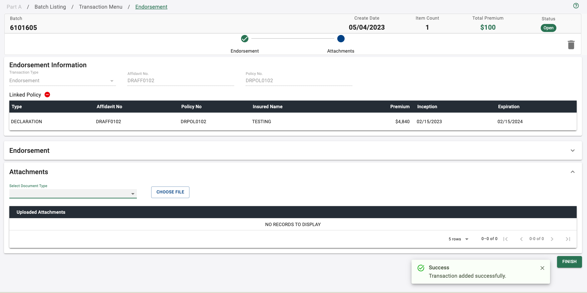
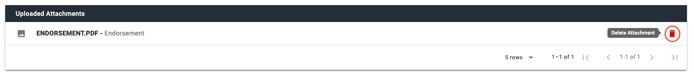
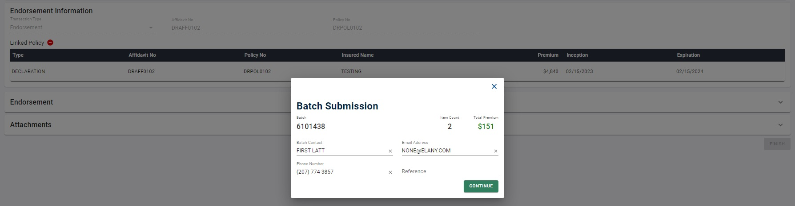

## Getting Started

#### Add Endorsement

The user will be able to add an Endorsement transaction to the system using two ways – they may create an endorsement transaction in a new batch or add an endorsement transaction to an existing batch, provided the transaction rules allow to add a transaction.

Please refer to this [link](/guides/parta/transaction-listing#add-transaction), to learn more about the rules to add a new transaction and how to add a new transaction to an existing batch.

Please refer to this [link](/guides/parta/batch-listing#add-batch), to learn more about adding a new transaction to a new batch.

Please note the following exceptions to creating Endorsement transactions –

• Endorsements **CANNOT** be linked to a parent transaction that belongs to a batch that has NOT been submitted. The exception to this rule is when the endorsement belongs to the same batch as that of the parent transaction.

• The user may add more than one endorsement in a batch, but they should **ALL** belong to the same affidavit (parent transaction).

• **ONLY** a 'Fee Endorsement' transaction can be executed on a ‘Binder’ transaction type.

##### Procedure Summary

1. Click on the **‘Endorsement’** option from the **‘Update Transaction’** section of the Transaction Menu page, as shown in _Figure 1_.

2. The Affidavit Search dialog appears that will be presented as an overlay on top of the Endorsement Entry page, as shown in _Figure 2_. Notice the informational message reminding the user that premium bearing endorsements can only be processed on a Declaration Page, with the exception of a fee endorsement, as shown in _Figure 3_.

3. Use the search criteria located at the top of the Affidavit Search dialog to locate the parent transaction that must be linked to the endorsement. Please refer to this [link](#affidavit-search), to learn more about how to use the Affidavit Search and [here](#advanced-search) to use the Advanced Search option.

4. From the Affidavit Search results, select the affidavit you want to link the endorsement with. Notice that the ‘SELECT’ button is disabled until an affidavit is selected from the search results, as shown in _Figure 4_.

5. To select the affidavit, click on the check box in front of the corresponding affidavit, as shown in _Figure 5_. The corresponding affidavit is highlighted and the ‘SELECT’ button is now enabled. Also, notice that the checkbox is disabled for certain transactions in the search results, as shown in _Figure 6_. This is because these transactions have not been submitted to ELANY and hence are not eligible. If the user clicks on the information icon next to the disabled checkbox, an informational message about this is displayed, as shown in _Figure 7_.
   To learn more about how to use the different features of the Affidavit Table (or Affidavit result set), please refer to this [link](#affidavit-table).

6. After selecting the appropriate affidavit, click on the ‘SELECT’ button, as shown in _Figure 8_.

7. The Affidavit Search dialog will close, and the Endorsement Entry page will now become available to the user to enter the required information. Notice that if an endorsement transaction is added to an existing batch, the corresponding batch number will be shown on the Batch Information header, as shown in _Figure 9_. However, if an endorsement transaction is added to a new batch, the batch number will show as ‘(NEW BATCH)’ on the Batch Information header, as shown in _Figure 10_. In this case, after all the required information for the Endorsement transaction is successfully saved, a batch number will be assigned.
   _In addition to the Batch Number, the Batch Information header will also include the Create Date, Item Count, Total Premium and Batch Status. Please note that this information CANNOT be edited by the user._

8. The Endorsement Information section is displayed below the stepper status. For more details on this section and how to remove the linked parent policy, please refer to this [link](#remove-linked-policy).

9. Please note that removing the linked parent policy for an Endorsement transaction is similar to that of a Renewal transaction. To learn more about how to remove the linked parent policy, please refer to this [link](/guides/parta/renewal-transactions#remove-linked-policy).

10. The ‘Endorsement’ accordion is automatically expanded, as shown in Figures 9 and 10. Please note that the ‘Attachments’ section is disabled at this point. Clicking on the ‘Expand Less’ icon at the far end of the ‘Endorsement’ section will not collapse this section either.

11. The user must enter the required Endorsement data. Please refer to this [link](#endorsement-data-section), for more details on the Endorsement data section.

12. After the required endorsement data is entered, click on the ‘CONTINUE’ button to save the information, as shown in _Figure 11_. Notice that the ‘UNDO’ button will be disabled until information is entered in this section. The user may use the ‘UNDO’ button to clear the data typed into these fields, as shown in _Figure 12_. The ‘Expand Less’ icon at the top right-hand corner of this accordion also saves the data in this section.

13. Once the Endorsement data is saved, a success message appears at the bottom right-hand corner of the screen, as shown in _Figure 13_. Additionally, a batch number is assigned if this is the first transaction in the batch.

14. The ‘Endorsement’ accordion automatically collapses and the ‘Attachments’ accordion expands, as shown in _Figure 14_.

15. The user may also click on the “<- TRANSACTION LISTING” button below the Batch Information header, as shown in _Figure 14(a)_ to go to the Transaction Listing page.

16. The user may attach the required documents for an endorsement transaction. However, attachments are NOT required when entering a Fee Endorsement transaction. To learn more about how to attach documents to the endorsement transaction, please refer to this [link](#upload-attachment).

17. In the midst of entering the data, if the user leaves the "Endorsement" page to go to another page (without saving), they will be prompted with a dialog box saying they have unsaved changes and if they would like to proceed or not, as shown in _Figure 15_. Click ‘OK’ to not save any changes and proceed to the requested page. Click ‘Cancel’ to close the dialog prompt and remain on the "Endorsement" Entry page to continue making changes.

18. Click on the ‘Finish’ button at the bottom right-hand corner of the "Endorsement" page, after all the required data is entered, as shown in _Figure 16_.

19. A Transaction Completion prompt will be presented as an overlay on top of the "Endorsement" Entry page, as shown in _Figure 17_.

20. Click on the green ‘SUBMIT BATCH’ button to submit the batch, if necessary. This provides a shortcut way to submit a batch from the "Endorsement" page itself, as shown in _Figure 17_.

21. When the user clicks on the ‘SUBMIT BATCH’ button, the Batch Submission prompt will display, as shown in _Figure 18_. The user may continue the batch submission from this prompt. For more details, please refer from Step 5 to Step 25 of the [Batch Listing - Submit Batch](/guides/parta/batch-listing#submit-batch) procedure summary.

22. Alternately, the user may choose to click on the ‘X’ button to close the Transaction Completion prompt and remain on the "Endorsement" Entry page, as shown in _Figure 19_.

###### _Figure 1 - Transaction Menu Page: Endorsement Transaction_

###### _Figure 2 - Affidavit Search: Overlay on Endorsement Entry Page_

###### _Figure 3 - Informational Message_

###### _Figure 4 - Affidavit Search Results - 'SELECT' Button Disabled_

###### _Figure 5 - Select Affidavit - 'SELECT' Button Enabled_

###### _Figure 6 - Ineligible Transactions_

###### _Figure 7 - Informational Message: Ineligible Transaction_

###### _Figure 8 - Click 'SELECT' Button_

###### _Figure 9 - Add Endorsement Transaction to an Existing Batch_

###### _Figure 10 - Add Endorsement Transaction to a New Batch_

###### _Figure 11 - 'CONTINUE' Button_

###### _Figure 12 - 'UNDO' Button_

###### _Figure 13 - Add Endorsement Transaction Success Message_

###### _Figure 14 - Attachments Accordion Opens Automatically_

.jpg)

###### _Figure 14(a) - Navigate to Transaction Listing_

###### _Figure 15 - Unsaved Changes Dialog Prompt_

###### _Figure 16 - 'FINISH' Button_

###### _Figure 17 - Transaction Completion Prompt_

###### _Figure 110 - ‘SUBMIT BATCH’ from Transaction Completion Prompt_

###### _Figure 18 - Batch Submission Prompt_

###### _Figure 19 - Close Transaction Completion Prompt_

</section>

---

<section markdown="1">

## Endorsement Information

This section of the Endorsement transaction displays the following data, as shown in _Figure 61_.

• Transaction Type – The type of transaction being created, which is an Endorsement.

• Affidavit No. – The affidavit number of the endorsement which is the same as the linked policy.

• Policy No. – The policy number of the endorsement which is the same as the linked policy.

_Please note that this information **CANNOT** be edited by the user._

#### Linked Policy

The Linked Policy displays the policy information that is linked to the endorsement. This shows the Transaction Type, Affidavit No, Policy No, Insured Name, Premium, Inception Date and Expiration Date of the linked policy, as shown in _Figure 61_. This information also serves as a reminder to the user to ensure that they picked the correct policy to amend.

###### _Figure 61 - Endorsement Information_

---

<section markdown="1">

## Endorsement Data Section

This section is where the user will enter pertinent information regarding the endorsement, as shown in _Figure 72_. While creating an endorsement that is linked to a ‘BINDER’ transaction type, important informational messages will appear in this section to remind the user that only a fee endorsement can be entered, as shown in _Figure 73_.

###### _Figure 72 - Endorsement Data Section_

###### _Figure 73 - Informational Messages when Linked Policy is a Binder_

---

#### Effective Date

The effective date is the date when the endorsement goes into effect and this data is required to create an Endorsement transaction in the system. The user may enter this field either by typing in the date or by clicking on the ‘Calendar’ icon to open the date picker and select the date, as shown in _Figure 74_.

###### _Figure 74 - Calendar Icon: Effective Date_

---

#### Expiration Date

The expiration date is the date that the policy will be extended to, and this data is optional to enter an Endorsement transaction in the system. The user may enter this field either by typing in the date or by clicking on the ‘Calendar’ icon to open the date picker and select the date, as shown in _Figure 75_. Notice the information highlighted in blue below this field to provide additional information to the user.
Please note that if a value is entered in this field, the Fee Endorsement toggle flag is defaulted to ‘No’ and this flag cannot be changed by the user, as shown in _Figure 75_. Similarly, the expiration date field will be disabled when entering a Fee Endorsement (i.e., when the Fee Endorsement toggle flag is set to ‘Yes’), as shown in _Figure 76_. Also, when the “Linked policy” is a Binder transaction type, this field will be disabled as Binders CANNOT be extended, as shown in _Figure 73_.

###### _Figure 75 - Calendar Icon: Expiration Date_

---

#### Premium

Premium refers to the dollar amount that is being added to or removed from the policy as a result of the Endorsement transaction. This data is required to enter an Endorsement transaction in the system. A negative amount may also be entered to reflect a return premium. Notice the information highlighted in blue below this field to provide additional information to the user.

---

#### Fee Endorsement

The Fee Endorsement toggle flag is used to indicate if the endorsement is a fee endorsement or not.
This field is always defaulted to ‘No’, except in the case when the “Linked policy” is a Binder transaction type. In this case, the flag is defaulted to ‘Yes’ and CANNOT be changed by the user, as shown in Figure. Additionally, in the case when an expiration date has been entered, this flag is defaulted to ‘No’ and cannot be changed by the user, as shown in Figure.
In all other cases, to toggle this flag from ‘No’ to ‘Yes’ or vice-versa, simply click on the ‘Toggle’ icon, as shown in _Figure 76_.

###### _Figure 76 - Toggle Icon: Fee Endorsement Toggle Flag_

---

</section>

<section markdown="1">

## Attachments Section

This section is where the user will attach the required documents to an Endorsement transaction. Each Endorsement transaction must have at least one attachment, with the exception of Fee Endorsements.

#### Upload Attachment

The user will be able to upload an attachment to an Endorsement transaction. The valid file types that can be uploaded are PDF, JPEG and TIFF files.

##### Procedure Summary

1. Click on the ‘Expand More’ icon located at the far end of the ‘Attachments’ accordion to expand the section (if it is not already expanded), as shown in Figure. This will open up the ‘Attachments’ accordion, as shown in _Figure 77_.

2. Click on ‘Select Document Type’ dropdown list, as shown in _Figure 78_. This will list the ‘Document types’ that can be uploaded for an Endorsement transaction, as shown in _Figure 79_. Please note that if the Expiration Date is entered in the “Endorsements” section, this list will display ‘Extension Endorsement’ doc type instead of ‘Endorsement’, as shown in _Figure 80_.

3. Click to select the appropriate Document Type for the document from the list displayed.

4. Click on the ‘Choose File’ button, as shown in _Figure 81_, to drill into the file system on the user’s local machine or local network to select the appropriate file. Once selected, this file will show up next to the ‘Choose File’ button.

5. Click on the icon, as shown in _Figure 82_, to save the attachment. When the attachment is successfully uploaded, a success message appears in the bottom right-hand corner of the screen, as shown in _Figure 83_. Additionally, the document will appear in the “Uploaded Attachments” table as shown in _Figure 84_, in the order it was uploaded. The user may also click on the icon to remove/clear the attachment prior to the upload, as shown in _Figure 85_.

6. To upload more attachments, go back to Step 2.

###### _Figure 77 - Open 'Attachments' Accordion_

###### _Figure 78 - Select Document Type_

###### _Figure 79 - Document Type List_

###### _Figure 80 - Document Type List When Expiration Date is Entered_

###### _Figure 81 - 'CHOOSE FILE' Button_

###### _Figure 82 - Save Attachment Icon_

###### _Figure 83 - Upload Attachment Success Message_

###### _Figure 84 - Uploaded Attachments Table_

###### _Figure 85 - Remove Attachment Icon_

---

#### View Attachment

The user may view the document(s) uploaded for the endorsement transaction from the “Uploaded Attachments” table, as shown in _Figure 86_.

##### Procedure Summary

1. Click on the icon in front of the document you would like to view, as shown in _Figure 86_.

2. The corresponding document opens up in a new window to view by the user.

###### _Figure 86 - View Attachment Icon_

---

#### Delete Attachment

The user may delete the document(s) uploaded for the endorsement transaction from the “Uploaded Attachments” table.

##### Procedure Summary

1. Click on the trashcan icon at the far end of the document you would like to delete, as shown in _Figure 87_.

2. A confirmation message will be presented as an overlay on top of the Endorsement Entry page, as shown in _Figure 88_, with 2 options displayed to the user – ‘Confirm’ or ‘Cancel’.

3. Click on ‘Confirm’ to confirm the discard attachment operation or ‘Cancel’ to cancel the discard attachment operation.

4. If the user clicks ‘Confirm’, the attachment is deleted and a success message appears at the bottom right-hand corner of the screen, as shown in _Figure 89_. Additionally, the document is also removed from the “Uploaded Attachments” table, as shown in _Figure 90_.

5. If the user clicks ‘Cancel’, the confirmation message closes, no changes are made, and the user remains on the Endorsement Entry page.

###### _Figure 87 - Delete Attachment Icon_

###### _Figure 88 - Delete Attachment Confirmation Message_

###### _Figure 89 - Delete Attachment Success Message_

###### _Figure 90 - Document Removed from the 'Uploaded Attachments' Table_

---

#### Attachments Table Rows Per Page

The user will be able to manipulate how many rows are visible to the user at one time using the ‘Rows’ dropdown list in the table footer. The user can change the maximum visible rows to 5,10, or 20. The default will be set to show 5 rows.

#### Procedure Summary

1. Click the ‘Rows’ dropdown list located in the table footer, as shown in _Figure 91_.

2. Select the option for maximum rows per page from the dropdown list, as shown in _Figure 92_.

###### _Figure 91 - Rows Dropdown List_

###### _Figure 92 - Rows Per Page Options_

</section>

---

#### Attachments Table Navigation

The user will be able to navigate through the rows using the navigation buttons located in the table footer. The user will be able to easily go to the ‘First Page’, ‘Previous Page’, ‘Next Page’, and ‘Last Page’ using the navigation buttons.

##### Procedure Summary

1. Click on the **‘Next Page’** button to navigate to the next page in the result set, as shown in _Figure 93_.

2. Click on the **‘Last Page’** button to navigate to the last page in the result set, as shown in _Figure 94_.

3. Click on the **‘Previous Page’** button to navigate to the previous page in the result set, as shown in _Figure 95_.

4. Click on the **‘First Page’** button to navigate to the first page in the result set, as shown in _Figure 96_.

###### _Figure 93 - Next Page Navigation Button_

###### _Figure 94 - Last Page Navigation Button_

###### _Figure 95 - Previous Page Navigation Button_

###### _Figure 96 - First Page Navigation Button_

<section markdown="1">

## Edit Endorsement

The user will be able to edit an existing Endorsement transaction in the system, provided the transaction rules allow for an edit. Please refer to this [link](/guides/parta/transaction-listing#edit-transaction), for more information on the rules and ways to get to the Endorsement entry page to edit the transaction.

##### Procedure Summary

1. The Endorsement entry page will be displayed if the endorsement transaction can be edited, as shown in _Figure 97_.

2. While editing an endorsement, the user may remove the Linked policy if they picked the incorrect one. Please note that in this case the entire transaction will be deleted, so the user may have to enter all the endorsement data again and upload any attachments, if applicable. To learn more about how to remove a linked policy, please refer to this [link](#remove-linked-policy).

3. The user will be able to access the “Instructions” sent by the ELANY Examiner for a batch that has been reopened by clicking the ‘Reopen Instruction’ icon at the end of transaction information section. This will show them the details of the email correspondence received from the ELANY Examiner. Please note that this option is ONLY available for batches with an ‘Action Required’ batch status and ‘Action Required’ transaction status. To learn more about ‘Reopen Instruction’, please refer to this [link](/guides/parta/new-transactions#view-reopen-instructions).

4. To edit the Endorsement data, the user may click on the ‘Expand More’ icon located at the far end of the “Endorsement” section, as shown in _Figure 98_.

5. The ‘Endorsement’ accordion is expanded, as shown in _Figure 99_.

6. The user may edit any endorsement data they want to. Notice that the ‘UNDO’ button will be disabled until data on this section is changed by the user, as shown in _Figure 99_. Please refer to this [link](#endorsement-data-section), for more details and rules regarding the Endorsement data.

7. Once the necessary edits are made to the endorsement data, the user may click ‘CONTINUE’ button to save the information, as shown in _Figure 100_. The user may click the ‘UNDO’ button to reset the data to the last saved value in these fields, as shown in _Figure 101_.

8. Alternately, closing the ‘Endorsement’ accordion manually by clicking the ‘Expand Less’ icon located at the far end of the “Endorsement” section, as shown in _Figure 102_, will also save the edits made to this section. Please note, when this section is manually closed, the ‘Attachments’ accordion does not expand automatically.

9. Once the Endorsement data is successfully saved, a success message appears at the bottom right-hand corner of the screen, as shown in _Figure 103_.

10. When the ‘CONTINUE’ button is used to save the data, the ‘Endorsement’ accordion automatically collapses and the ‘Attachments’ accordion expands, as shown in _Figure 104_.

11. Alternately, to edit (add or remove) the attachments, the user may manually click on the ‘Expand More’ icon located at the far end of the “Attachments” section, as shown in _Figure 105_. The ‘Attachments’ accordion is expanded, as shown in _Figure 106_.

12. Please refer to this [link](#attachments-section), for more details on how to upload a new attachment or delete an existing attachment from an endorsement transaction.

13. In the midst of making any changes to the data, if the user leaves the Endorsement page to go to another page (without saving), they will be prompted with a dialog box saying they have unsaved changes and if they like to proceed or not, as shown in _Figure 107_. Click ‘OK’ to not save any changes and proceed to the requested page. Click ‘Cancel’ to close the dialog prompt and remain on the Endorsement page to continue making changes.

14. Click on the ‘Finish’ button at the bottom right-hand corner of the Endorsement page, as shown in _Figure 108_ after all the required edits have been made.

15. A Transaction Completion prompt will be presented as an overlay on top of the Endorsement Entry page, as shown in _Figure 109_.

16. Click on the green ‘SUBMIT BATCH’ button on this prompt to submit the batch, if necessary as shown in _Figure 110_. This provides a shortcut way to submit a batch from the Endorsement page itself.

17. When the user clicks on the ‘SUBMIT BATCH’ button, the Batch Submission prompt will display, as shown in _Figure 111_. The user may continue the batch submission from this prompt. For more details, please refer from Step 5 to Step 25 of the [Batch Listing - Submit Batch](/guides/parta/batch-listing#submit-batch) procedure summary.

18. Alternately, the user may choose to click on the ‘X’ button to close the Transaction Completion prompt and remain on the Endorsement Entry page, as shown in _Figure 112_.

###### _Figure 97 - Edit Endorsement_

###### _Figure 98 - Open Endorsement Accordion Manually_

###### _Figure 99 - Edit Endorsement Data_

###### _Figure 100 - 'CONTINUE' Button_

###### _Figure 101 - 'UNDO' Button_

###### _Figure 102 - Close Endorsement Accordion Manually_

###### _Figure 103 - Update Transaction Success Message_

###### _Figure 104 - Attachments Accordion Opens Automatically_

###### _Figure 105 - Open Attachments Accordion Manually_

###### _Figure 106 - Attachments Section Opened Manually_

###### _Figure 107 - Unsaved Changes Dialog Prompt_

###### _Figure 108 - 'FINISH' Button_

###### _Figure 109 - Transaction Completion Prompt_

###### _Figure 110 - ‘SUBMIT BATCH’ from Transaction Completion Prompt_

###### _Figure 111 - Batch Submission Prompt_

###### _Figure 112 - Close Transaction Completion Prompt_

---

</section>

<section markdown="1">

## Delete Endorsement

The user will be able to delete an existing Endorsement transaction in the system, provided the transaction rules allow for a delete. Please refer to this [link](/guides/parta/transaction-listing#delete-transaction), for more information on the delete transaction rules, an alternate way to delete the transaction and how to get to the Endorsement entry page to delete the transaction from this page.

##### Procedure Summary

1. Click on the Trash can icon located on the top right-hand corner of the screen, below the Batch Information header and next to the transaction stepper status. Notice this icon will turn red, when you hover over to click on it, as shown in _Figure 112_. Please note that this icon will be disabled when the user is NOT allowed to delete the transaction.

2. A confirmation message will be presented as an overlay on top of the Endorsement Entry page, as shown in _Figure 113_, with 2 options displayed to the user – ‘Confirm’ or ‘Cancel’.

3. Click on ‘Confirm’ to confirm the delete transaction operation or ‘Cancel’ to cancel the delete transaction operation.

4. If the user clicks ‘Confirm’, the transaction is deleted and a success message appears at the bottom right-hand corner of the screen, as shown in _Figure 114_. The user will be taken to the Transaction Listing page. Notice that the Item Count and Total Premium fields on the Batch Information header is updated.
   Additionally, if the endorsement being deleted is the only transaction in the batch, the associated batch will also be deleted and a different success message appears at the bottom right-hand corner of the screen, as shown in _Figure 115_. The user will be taken to the Batch Listing page.

5. If the user clicks ‘Cancel’, the confirmation message closes, no changes are made, and the user remains on the Endorsement Entry page.

###### _Figure 112 - Trashcan Icon: Endorsement Entry Page_

###### _Figure 113 - Delete Transaction Confirmation Message_

###### _Figure 114 - Delete Transaction Success Message_

###### _Figure 115 - Delete Transaction and Delete Batch Success Message_

---

</section>

<button id="scroll" onclick="scrollToTop()">
<svg xmlns="http://www.w3.org/2000/svg" height="24" viewBox="0 0 24 24" width="24">
<path d="M0 0h24v24H0z" fill="none"/>
<path d="M7.41 15.41L12 10.83l4.59 4.58L18 14l-6-6-6 6z" fill="rgb(231, 233, 231)"/>
</svg>
</button>

<title>Part A Endorsement User Guide</title>
<link markdown="1" rel="stylesheet" type="text/css" href="../../assets/css/aeros-components.css" />
<!-- <link markdown="1" rel="stylesheet" type="text/css" href="../../assets/css/styles.css" /> -->
<link markdown="1" rel="stylesheet" href="https://cdnjs.cloudflare.com/ajax/libs/font-awesome/5.15.3/css/all.min.css" integrity="sha512-iBBXm8fW90+nuLcSKlbmrPcLa0OT92xO1BIsZ+ywDWZCvqsWgccV3gFoRBv0z+8dLJgyAHIhR35VZc2oM/gI1w==" crossorigin="anonymous" />
<link href="https://fonts.googleapis.com/icon?family=Material+Icons" rel="stylesheet"/>
<link rel="preconnect" href="https://fonts.googleapis.com">
<link rel="preconnect" href="https://fonts.gstatic.com" crossorigin>
<link href="https://fonts.googleapis.com/css2?family=Roboto:ital,wght@0,300;0,400;0,500;0,700;1,300;1,400;1,500;1,700&display=swap" rel="stylesheet">

